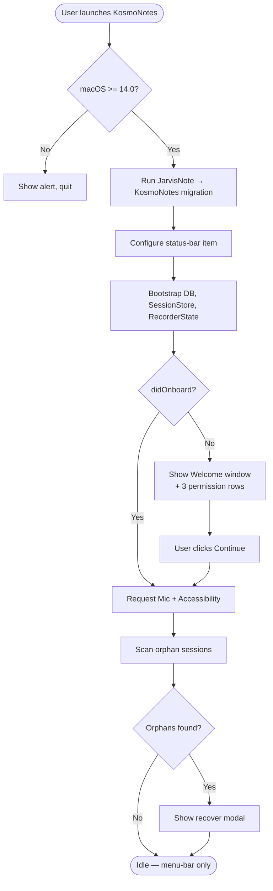
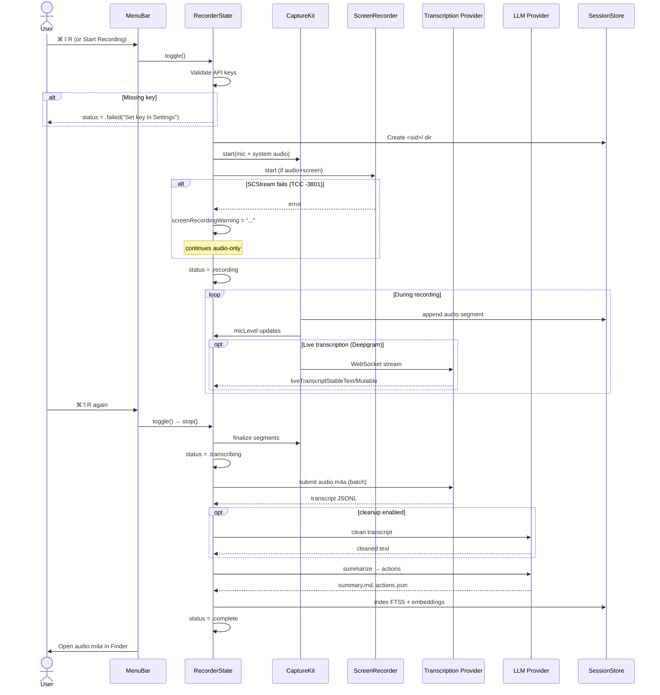
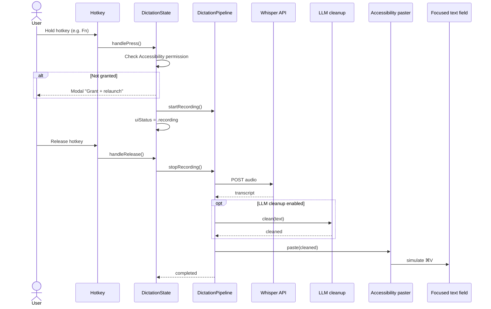
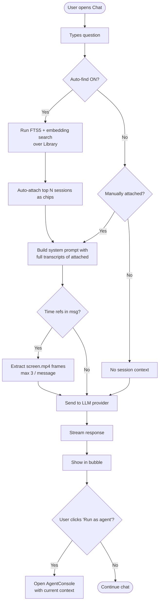
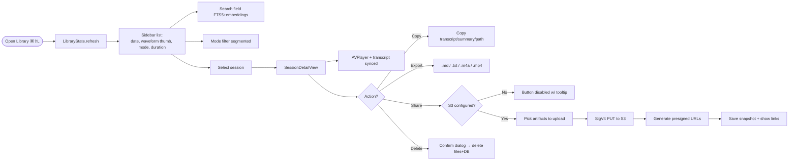
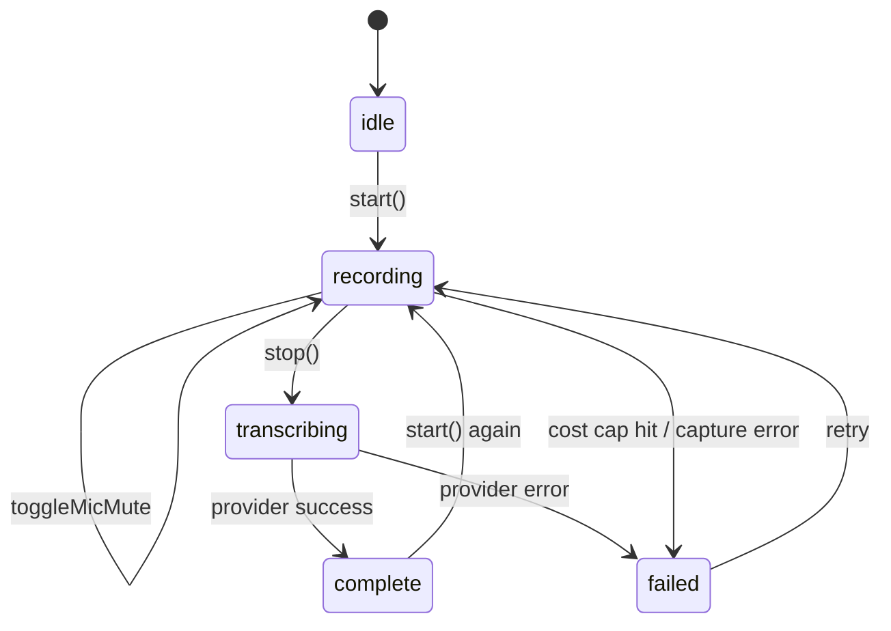
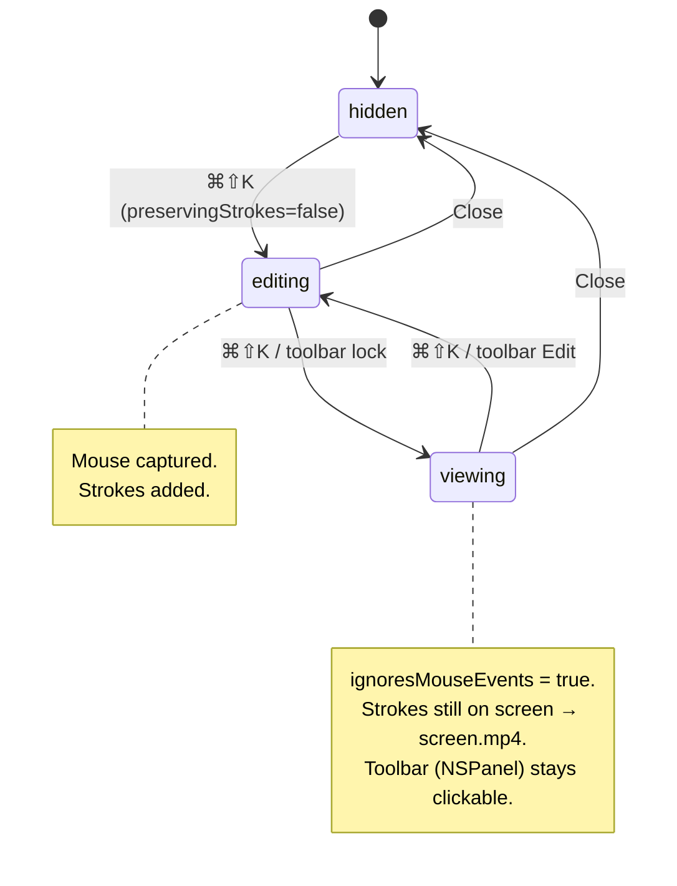
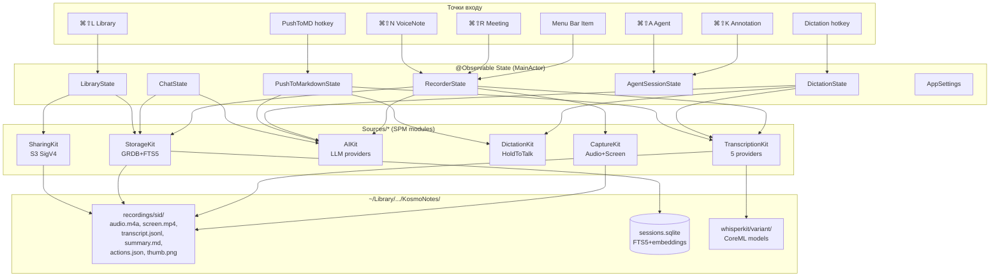

# KosmoNotes — аудит фіч, користувацьких флов та продуктових проблем

**Дата:** 2026-05-20
**Бранч:** develop
**Скоуп:** продуктовий аналіз через статичне дослідження кодової бази (App/ + Sources/)

---

## 1. Фічі додатку

KosmoNotes — це menu-bar macOS-додаток для запису, транскрипції, AI-аналізу та шерингу аудіо/скрінкастів зустрічей. Знайдено **10 ключових функцій**:

| # | Фіча | Тригер | Призначення |
|---|------|--------|-------------|
| 1 | **Onboarding** | Перший запуск | Запитує 3 permissions: Mic, Screen, Accessibility |
| 2 | **Meeting Recording** | ⌘⇧R | Запис мітингу (audio або audio+screen) + транскрипція + AI summary |
| 3 | **Voice Note Mode** | ⌘⇧N | Короткий запис з шаблонами (freeform/task/journal/checklist) |
| 4 | **Dictation** | hold-to-talk hotkey | Запис → Whisper → LLM cleanup → paste у фокусне поле |
| 5 | **Push-to-Markdown** | hold-to-talk hotkey | Той самий pipeline, але результат → `.md` файл у вказану папку |
| 6 | **Library** | ⌘⇧L (статус-бар) | Перегляд сесій, FTS5 пошук, плеєр з тайм-кодами, експорт, share |
| 7 | **Chat with sessions** | Меню → Chat | Чат з AI, auto-find контексту, live snapshot під час запису |
| 8 | **Agent Console** | ⌘⇧A | Автономний агент (Claude tool-use) у workspace-папці |
| 9 | **Annotation overlay** | ⌘⇧K | Малювання поверх екрану — попадає у screen.mp4 |
| 10 | **Share to S3** | Library → Share | Аплоад артефактів у S3/R2/B2 з presigned URL |

---

## 2. Користувацькі флов

### 2.1 Перший запуск (Onboarding)

### 2.2 Запис зустрічі (Meeting flow)

### 2.3 Dictation flow (hold-to-talk)

### 2.4 Chat з сесіями

### 2.5 Library — перегляд та шер

### 2.6 Стейт-машина запису

### 2.7 Стейт-машина Annotation overlay

---

## 3. Архітектурна карта функцій

---

## 4. Проблеми продукту

### 4.1 Критичні (UX / адопшн)

| # | Проблема | Доказ у коді | Вплив |
|---|----------|--------------|-------|
| **P1** | **Немає нотаризації** → користувач робить `xattr -d com.apple.quarantine` вручну | CLAUDE.md: "Not notarized — hand-shared binaries require Gatekeeper bypass" | Бар'єр для не-розробників майже непрохідний |
| **P2** | **Screen Recording TCC ламається на macOS 15+/26** після підпису. Хелп пропонує `tccutil reset` як один з варіантів | `KosmoNotesApp.swift:96–99`, `RecorderState.screenRecordingWarning` | Користувач думає, що додаток зламаний |
| **P3** | **Немає popover/main window** — додаток повністю керується status-bar меню. Live-транскрипт показується урізаним у пункті меню (48+32 символи) | `formatLiveTranscriptLine` обрізає до 48/32 | "Прозорий" UI: користувачі не розуміють, що відбувається під час запису |
| **P4** | **10 табів у Settings** (Transcription / AI Providers / Dictation / Voice Note / Hotkeys / Sharing / Markdown / Agent / Privacy / Logs), причому ширина вікна 760pt лише щоб labels не обрізались | `SettingsView.swift:20–56` | Когнітивне перевантаження; нові користувачі загубляться |
| **P5** | **5 провайдерів транскрипції** (Deepgram / OpenAI / Gemini / OpenRouter / WhisperKit) + ще 4 LLM-провайдери з окремими ключами | `SettingsView` Transcription/AI tabs | Параліч вибору; failure modes різні для кожного |
| **P6** | **Voice Note != окремий режим у Settings**, а лише prompt template + hotkey. Користувач очікує, що ⌘⇧N і ⌘⇧R дають різні результати — але різниця лише у промпті summary | `KosmoNotesApp.voiceNoteToggleAction` викликає `recorder.start(mode: .voiceNote)` | Неочікувана поведінка: запис ідентичний, "магія" непомітна |

### 4.2 Помітні (functional gaps)

| # | Проблема | Доказ | Вплив |
|---|----------|-------|-------|
| **P7** | **Немає редагування транскрипту** — лише копіювати/експортувати | `SessionDetailView`: тільки `.textSelection(.enabled)` без edit | Неможливо виправити ASR-помилки перед шерингом |
| **P8** | **Немає організації сесій** — ні папок, ні тегів, ні перейменування. Лише дата + mode + duration | `SidebarView`: тільки query + modeFilter | На 100+ сесій бібліотека стає кладовищем |
| **P9** | **Share вимагає власний S3-bucket + ключі від користувача** — нема дефолтного хостингу | `Sharing` tab: `s3Endpoint`, `s3Bucket`, `s3AccessKey`, `s3SecretKey` | Висока friction; 99% користувачів не мають S3 |
| **P10** | **Дефолтний "Open in Finder" замість сповіщення про готовність** — після стопу одразу відкривається Finder з audio.m4a | `recordToggleAction:535–538` | Перебиває фокус, особливо для коротких записів |
| **P11** | **Cost-cap — modal, що блокує** під час post-process | RecorderState `confirmCostOverage` (з CLAUDE.md) | Користувач, що вийшов з-за компа, повертається до зависшого pipeline |
| **P12** | **Agent потребує конфігурації CLI runner** (built-in або external) і не має guided setup. UI: "Hold ⌘⇧A and speak" — без onboarding | `AgentConsoleView.swift:50` empty state | Половина юзерів не дізнається, як його запустити |
| **P13** | **Annotation overlay коректно працює лише з Audio+Screen mode**. У audio-only режимі strokes нікуди не зберігаються | Comment у `AnnotationController.swift:23–27` | Hotkey активний завжди, але ефект непомітний |
| **P14** | **Chat snapshot mode доступний тільки під час активного запису** і обмежений "last ~60s" | `ChatView.bottomInputArea: chat.isRecording` | Якщо запис уже зупинено — функція зникає |

### 4.3 Технічний борг, що б'є по UX

| # | Проблема | Доказ |
|---|----------|-------|
| **P15** | **MainActor + 12 holder-ів** в AppDelegate як `AnyObject?` через `@available` на storage property | `KosmoNotesApp.swift:31–48` |
| **P16** | **5-min позицій менюшки в menuNeedsUpdate** — string-matching по identifier — крихка проти ре-orderу | `extension AppDelegate: NSMenuDelegate` |
| **P17** | **Recovery flow** — orphan-сесії знаходяться **тільки на launch**. Якщо процес упав і користувач не перезапустив додаток, відновлення не відбудеться у фоні | `bootstrapAppState`: `coordinator.runAtLaunch` |
| **P18** | **TCC підпис ламається при оновленні** — обхід через post-build `codesign --force --deep` замість xcodebuild flag. CI/release pipeline не стандартний | CLAUDE.md "Code signing note" |

---

## 5. Рекомендації (top-5 за ROI)

1. **Notarize the build** — без цього навіть бета-тестування за межами розробника майже неможливе. Найбільший ROI.
2. **Замінити status-bar-only UX на main window з popover** для live recording — користувач бачить waveform, time, transcript, mute-кнопку без походів у меню.
3. **Скоротити Settings до 4 табів**: General / Providers / Hotkeys / Advanced. 10 — це переборщ; Logs має бути окрема прихована команда.
4. **Editable transcript** + drag-rearrange сегментів. Це основний use case у конкурентів (Otter, Granola).
5. **Дефолтний hosted share** (наприклад через ваш API-проксі на S3/R2), а user-bucket — як advanced опція. Інакше "Share to S3" — мертва кнопка для більшості.
